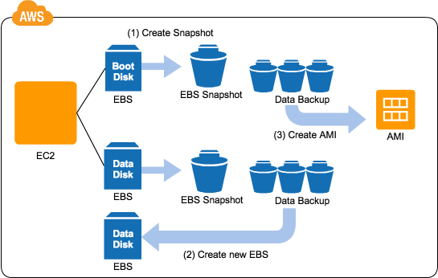
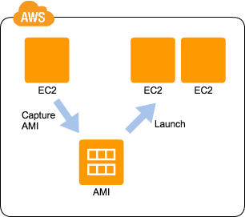
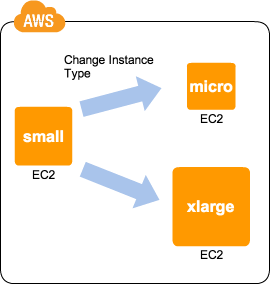
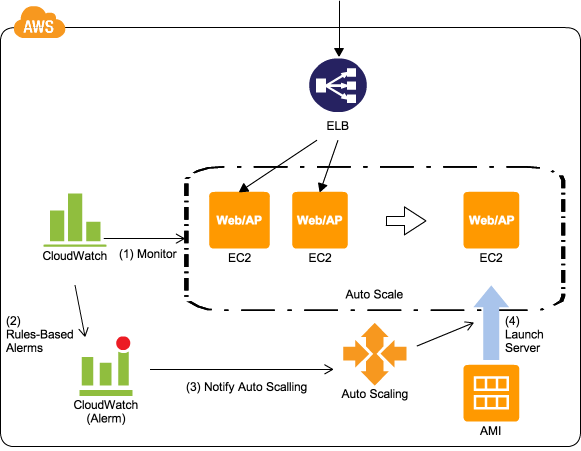
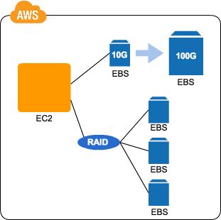

# Cloud Design Pattern

2016-04-19

\#study\_mtg\_engineering

Yuta Sakamaki @ SS

---

## Cloud Design Patternとは

(※以下、Cloud Design Pattern = CDPと記載。)

- GoFのデザインパターン的なアレのクラウド版。
- Amazon Web Service(AWS)のサービスを例に上げて提唱されているが、基本的にはGoogle Cloud Platform(GCP)やMicrosoft Azure等、他のクラウドサービスにおいても適用可能（なはず）。
- ぶっちゃけあんまりおもしろくない。

---

## CDP一覧

---

57種類のパターンがあり、大きく分けて9つに分類される。

---

### 基本パターン

Snapshot, Stamp, Scale Up, Scale Out, Ondemand Disk

### 可用性向上パターン

Multi-Server, Multi-Datacenter, Floating IP, Deep Health Check, Routing-Based HA

### 動的コンテンツの処理パターン

Clone Server, NFS Sharing, NFS Replica, State Sharing, URL Rewriting, Rewrite Proxy, Cache Proxy, Scheduled Scale Out, IP Pooling

---

### 静的コンテンツの処理パターン

Web Storage, Direct Hosting, Private Distribution, Cache Distribution, Rename Distribution, Private Cache Distribution, Latency Based Origin

### データアップロードのパターン

Write Proxy, Storage Index, Direct Object Upload

### リレーショナルデータベースのパターン

DB Replication, Read Replica, Inmemory DB Cache, Sharding Write

---

### 非同期処理／バッチ処理のパターン

Queuing Chain, Priority Queue, Job Observer, Fanout

### 運用保守のパターン

Bootstrap, Cloud DI, Stack Deployment, Server Swapping, Monitoring Integration, Weighted Transition, Log Aggregation, Ondemand Activation

### ネットワークのパターン

Backnet, Functional Firewall, Operational Firewall, Multi Load Balancer, WAF Proxy, CloudHub, Sorry Page, Self Registration, RDP Proxy, Floating Gateway, Shared Service, High Availability NAT

---

※この他にも、現在策定中のものや過去に廃止されたパターンも存在する模様。

---

## 基本パターンの概要

---

### Snapshot Pattern

---

- EBSのスナップショット機能を使うと、高耐久性を持つS3へのバックアップ処理が簡単に出来る、という話。
- 復元も手軽に行えるので、データが破損したりロストしても簡単にロールバックできる。
- OSごとバックアップし、ある時点の状態を完全に復元するといったことも容易に行える。
- 差分バックアップとなるため、高頻度でスナップショットを取得しても多額の保存料金が必要になることは基本的には無い。
- リージョン間転送も行えるので、ディザスタリカバリも行える。
- APIを用いることで、バックアップの自動化も容易。
- スナップショットのタイミングによってはデータに不整合が起きるので、注意が必要。

---

### Stamp Pattern

---

- 一通り環境構築を行ったEC2インスタンスからAMIを作成すると、スタンプを押すように容易にクローン環境が作れる。
- プロビジョニングツールを用いた環境構築よりも圧倒的に早く動く環境が複製できる。
- ブラックボックス化するので、実運用時はスナップショット元のインスタンスを構築する際の構成管理が最低限の必須だと思う。
- 派生系のデザインパターンとしてBootstrapパターンがある(今回紹介はしない。)。

---

### Scale Up Pattern

---

- インスタンスタイプをより高スペックなものに変えるっていうだけ。
- オンプレミスであればハードウェアを新たに調達するということなので、柔軟且つ迅速にスペックの変更を行えるのもクラウドの利点。
- 基本的にはスケールアウトさせることを検討すべきだが、DBなどスケールアウトが難しい場合に利用される（但し、根本的な解決方法は別に検討するべき。）。

---

### Scale Out Pattern

---

- スケールアップが単一のインスタンスの処理能力を向上させるアプローチなのに対して、こちらはインスタンスの数を増やすことで総処理能力を向上させるというアプローチ。
- Scale Up Patternに比べて、ダウンタイムがない、理論上処理能力の上限がない、自動化が容易などのメリットがある。
- クラウド（AWS）では、CloudWatchを利用して取得したメトリクスとELBやAuto Scaling等を組みあせて、比較的容易に構築することができる。
- 自動化により不要なスケールアウト／インを繰り返してしまうとEC2インスタンスの利用料金が無駄に発生してしまうので、注意が必要。
- Elastic Beanstalkを利用して構築した環境は、このScale Out Patternで実装されている。

---

### OnDemand Disk Pattern

---

- 仮想ディスクを用いることで、必要な分だけ適切なサイズ・性能のディスク領域を利用すことが出来る。
- RAID構成によってディスクI/O性能を向上させることも容易に出来る。
- サイズを変えたい場合、スナップショットからサイズを指定して新しいEBSボリュームを作成する必要がある。

---

## 最後に

- 書籍: [Amazon Web Service クラウドデザインパターン設計ガイド 改訂版](http://www.amazon.co.jp/dp/4822277372) は買わない方がいい( [http://aws.clouddesignpattern.org](http://aws.clouddesignpattern.org) の内容がほぼそのまま書いてあるだけ。)。
- 基本パターンだけだとつまらなすぎた。。。
- Docker等は一切出てこないので、そういうAWS外のツールを用いることでより良いパターンが作れそうな気がする。
